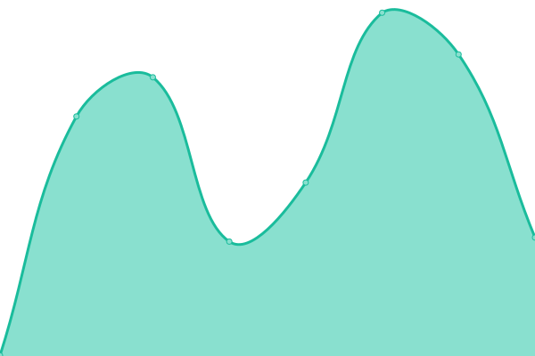
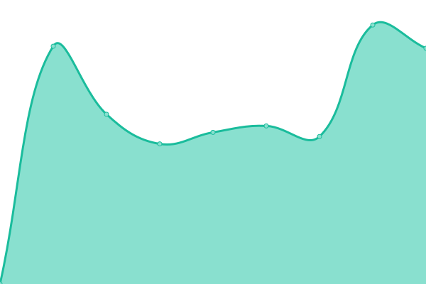
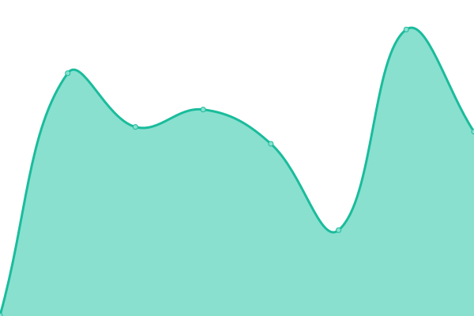
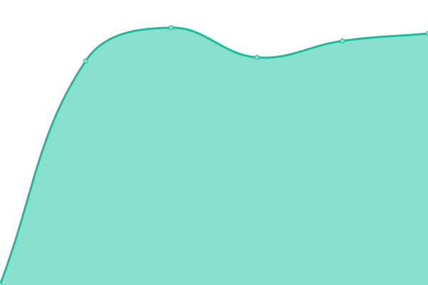
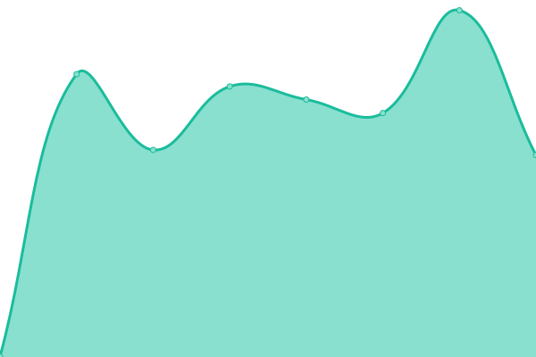
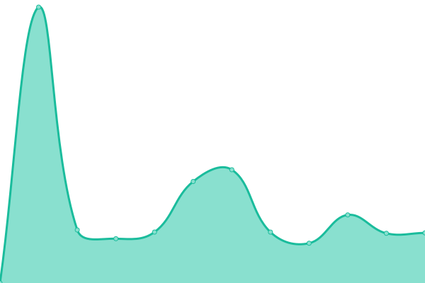

# [📈 Live Status](https://iwyang.github.io/check): <!--live status--> **🟩 All systems operational**

This repository contains the open-source uptime monitor and status page for [iwyang](https://iwyang.github.io), powered by [Upptime](https://github.com/upptime/upptime).

With [Upptime](https://upptime.js.org), you can get your own unlimited and free uptime monitor and status page, powered entirely by a GitHub repository. We use [Issues](https://github.com/iwyang/check/issues) as incident reports, [Actions](https://github.com/iwyang/check/actions) as uptime monitors, and [Pages](https://iwyang.github.io/check) for the status page.

<!--start: status pages-->
<!-- This summary is generated by Upptime (https://github.com/upptime/upptime) -->
<!-- Do not edit this manually, your changes will be overwritten -->
<!-- prettier-ignore -->
| URL | Status | History | Response Time | Uptime |
| --- | ------ | ------- | ------------- | ------ |
|  [Bore's Notes](https://bore.vip) | 🟩 Up | [bore-s-notes.yml](https://github.com/iwyang/check/commits/HEAD/history/bore-s-notes.yml) | 

 561ms
     
 | 

<a href="https://iwyang.github.io/check/history/bore-s-notes">100.00%</a>
    

|  [ConstOwn](https://blog.juanertu.com) | 🟩 Up | [const-own.yml](https://github.com/iwyang/check/commits/HEAD/history/const-own.yml) | 

 1673ms
     
 | 

<a href="https://iwyang.github.io/check/history/const-own">100.00%</a>
    

|  [01小丁的个人博客](https://tding.top) | 🟩 Up | [01.yml](https://github.com/iwyang/check/commits/HEAD/history/01.yml) | 

 401ms
     
 | 

<a href="https://iwyang.github.io/check/history/01">100.00%</a>
    

|  [Xu's Blog](https://hasaik.com) | 🟩 Up | [xu-s-blog.yml](https://github.com/iwyang/check/commits/HEAD/history/xu-s-blog.yml) | 

 308ms
     
 | 

<a href="https://iwyang.github.io/check/history/xu-s-blog">100.00%</a>
    

|  [02知行志](https://baozi.fun) | 🟩 Up | [02.yml](https://github.com/iwyang/check/commits/HEAD/history/02.yml) | 

 2055ms
     
 | 

<a href="https://iwyang.github.io/check/history/02">100.00%</a>
    

|  [Takagi](https://lixingyong.com) | 🟩 Up | [takagi.yml](https://github.com/iwyang/check/commits/HEAD/history/takagi.yml) | 

 1922ms
     
 | 

<a href="https://iwyang.github.io/check/history/takagi">96.13%</a>
    

|  [03千与千寻](https://www.chihiro.org.cn) | 🟩 Up | [03.yml](https://github.com/iwyang/check/commits/HEAD/history/03.yml) | 

 1334ms
     
 | 

<a href="https://iwyang.github.io/check/history/03">100.00%</a>
    

|  [Bill Yang's Blog](https://blog.bill.moe) | 🟩 Up | [bill-yang-s-blog.yml](https://github.com/iwyang/check/commits/HEAD/history/bill-yang-s-blog.yml) | 

 1247ms
     
 | 

<a href="https://iwyang.github.io/check/history/bill-yang-s-blog">100.00%</a>
    

|  [Sanarous's Blog](https://bestzuo.cn) | 🟩 Up | [sanarous-s-blog.yml](https://github.com/iwyang/check/commits/HEAD/history/sanarous-s-blog.yml) | 

 1835ms
     
 | 

<a href="https://iwyang.github.io/check/history/sanarous-s-blog">100.00%</a>
    

|  [JACK小桔子的小屋](https://jackxjz.top) | 🟩 Up | [jack.yml](https://github.com/iwyang/check/commits/HEAD/history/jack.yml) | 

 796ms
     
 | 

<a href="https://iwyang.github.io/check/history/jack">100.00%</a>
    

|  [04若只如初见](https://joyli.net.cn) | 🟩 Up | [04.yml](https://github.com/iwyang/check/commits/HEAD/history/04.yml) | 

 339ms
     
 | 

<a href="https://iwyang.github.io/check/history/04">100.00%</a>
    

|  [05大大的小蜗牛](https://eallion.com) | 🟩 Up | [05.yml](https://github.com/iwyang/check/commits/HEAD/history/05.yml) | 

 241ms
     
 | 

<a href="https://iwyang.github.io/check/history/05">100.00%</a>
    

|  [guole's Blog](https://guole.fun) | 🟩 Up | [guole-s-blog.yml](https://github.com/iwyang/check/commits/HEAD/history/guole-s-blog.yml) | 

 294ms
     
 | 

<a href="https://iwyang.github.io/check/history/guole-s-blog">100.00%</a>
    

<!--end: status pages-->

[**Visit our status website →**](https://iwyang.github.io/check)

## 📄 License

- Powered by: [Upptime](https://github.com/upptime/upptime)
- Code: [MIT](./LICENSE) © [iwyang](https://iwyang.github.io)
- Data in the `./history` directory: [Open Database License](https://opendatacommons.org/licenses/odbl/1-0/)
