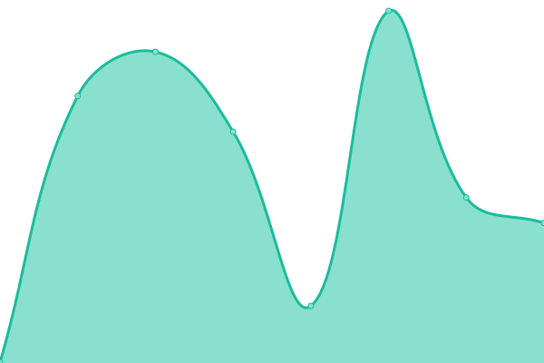

# [📈 Live Status](https://iwyang.github.io/check): <!--live status--> **🟧 Partial outage**

This repository contains the open-source uptime monitor and status page for [iwyang](https://iwyang.github.io), powered by [Upptime](https://github.com/upptime/upptime).

With [Upptime](https://upptime.js.org), you can get your own unlimited and free uptime monitor and status page, powered entirely by a GitHub repository. We use [Issues](https://github.com/iwyang/check/issues) as incident reports, [Actions](https://github.com/iwyang/check/actions) as uptime monitors, and [Pages](https://iwyang.github.io/check) for the status page.

<!--start: status pages-->
<!-- This summary is generated by Upptime (https://github.com/upptime/upptime) -->
<!-- Do not edit this manually, your changes will be overwritten -->
<!-- prettier-ignore -->
| URL | Status | History | Response Time | Uptime |
| --- | ------ | ------- | ------------- | ------ |
|  [Bore's Notes](https://bore.vip) | 🟩 Up | [bore-s-notes.yml](https://github.com/iwyang/check/commits/HEAD/history/bore-s-notes.yml) | 

 1251ms
     
 | 

<a href="https://iwyang.github.io/check/history/bore-s-notes">87.90%</a>
    

|  [ConstOwn](https://blog.juanertu.com) | 🟩 Up | [const-own.yml](https://github.com/iwyang/check/commits/HEAD/history/const-own.yml) | 

 1397ms
     
 | 

<a href="https://iwyang.github.io/check/history/const-own">100.00%</a>
    

|  [01小丁的个人博客](https://tding.top) | 🟩 Up | [01.yml](https://github.com/iwyang/check/commits/HEAD/history/01.yml) | 

 313ms
     
 | 

<a href="https://iwyang.github.io/check/history/01">100.00%</a>
    

|  [Xu's Blog](https://hasaik.com) | 🟩 Up | [xu-s-blog.yml](https://github.com/iwyang/check/commits/HEAD/history/xu-s-blog.yml) | 

 289ms
     
 | 

<a href="https://iwyang.github.io/check/history/xu-s-blog">100.00%</a>
    

|  [Takagi](https://lixingyong.com) | 🟥 Down | [takagi.yml](https://github.com/iwyang/check/commits/HEAD/history/takagi.yml) | 

 1557ms
     
 | 

<a href="https://iwyang.github.io/check/history/takagi">98.73%</a>
    

|  [IILeeのBlog](https://www.iilee.cn) | 🟩 Up | [ii-lee-blog.yml](https://github.com/iwyang/check/commits/HEAD/history/ii-lee-blog.yml) | 

 1932ms
     
 | 

<a href="https://iwyang.github.io/check/history/ii-lee-blog">97.00%</a>
    

|  [Bill Yang's Blog](https://blog.bill.moe) | 🟩 Up | [bill-yang-s-blog.yml](https://github.com/iwyang/check/commits/HEAD/history/bill-yang-s-blog.yml) | 

 1261ms
     
 | 

<a href="https://iwyang.github.io/check/history/bill-yang-s-blog">100.00%</a>
    

|  [04若只如初见](https://joyli.net.cn) | 🟩 Up | [04.yml](https://github.com/iwyang/check/commits/HEAD/history/04.yml) | 

 283ms
     
 | 

<a href="https://iwyang.github.io/check/history/04">100.00%</a>
    

|  [Sanarous](https://bestzuo.cn) | 🟩 Up | [sanarous.yml](https://github.com/iwyang/check/commits/HEAD/history/sanarous.yml) | 

 1882ms
     
 | 

<a href="https://iwyang.github.io/check/history/sanarous">100.00%</a>
    

|  [05大大的小蜗牛](https://eallion.com) | 🟩 Up | [05.yml](https://github.com/iwyang/check/commits/HEAD/history/05.yml) | 

 1708ms
     
 | 

<a href="https://iwyang.github.io/check/history/05">98.83%</a>
    

|  [guole's Blog](https://guole.fun) | 🟩 Up | [guole-s-blog.yml](https://github.com/iwyang/check/commits/HEAD/history/guole-s-blog.yml) | 

 254ms
     
 | 

<a href="https://iwyang.github.io/check/history/guole-s-blog">100.00%</a>
    

|  [cywhat’s blog](https://cywhat.cn) | 🟩 Up | [cywhat-s-blog.yml](https://github.com/iwyang/check/commits/HEAD/history/cywhat-s-blog.yml) | 

 362ms
     
 | 

<a href="https://iwyang.github.io/check/history/cywhat-s-blog">100.00%</a>
    

|  [Akilarの糖果屋](https://akilar.top) | 🟥 Down | [akilar.yml](https://github.com/iwyang/check/commits/HEAD/history/akilar.yml) | 

 1117ms
     
 | 

<a href="https://iwyang.github.io/check/history/akilar">94.07%</a>
    

|  [Slcp の童话镇](https://slcp.top) | 🟩 Up | [slcp.yml](https://github.com/iwyang/check/commits/HEAD/history/slcp.yml) | 

 1366ms
     
 | 

<a href="https://iwyang.github.io/check/history/slcp">100.00%</a>
    

|  [Nekolas's Blog](https://blog.nekolas.cafe/) | 🟩 Up | [nekolas-s-blog.yml](https://github.com/iwyang/check/commits/HEAD/history/nekolas-s-blog.yml) | 

 367ms
     
 | 

<a href="https://iwyang.github.io/check/history/nekolas-s-blog">100.00%</a>
    

<!--end: status pages-->

[**Visit our status website →**](https://iwyang.github.io/check)

## 📄 License

- Powered by: [Upptime](https://github.com/upptime/upptime)
- Code: [MIT](./LICENSE) © [iwyang](https://iwyang.github.io)
- Data in the `./history` directory: [Open Database License](https://opendatacommons.org/licenses/odbl/1-0/)
