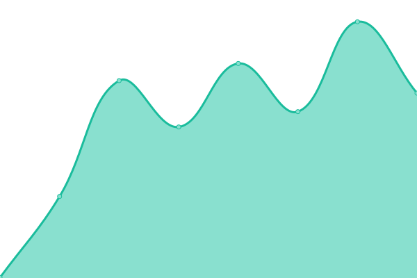

# [📈 Live Status](https://iwyang.github.io/check): <!--live status--> **🟧 Partial outage**

This repository contains the open-source uptime monitor and status page for [iwyang](https://iwyang.github.io), powered by [Upptime](https://github.com/upptime/upptime).

With [Upptime](https://upptime.js.org), you can get your own unlimited and free uptime monitor and status page, powered entirely by a GitHub repository. We use [Issues](https://github.com/iwyang/check/issues) as incident reports, [Actions](https://github.com/iwyang/check/actions) as uptime monitors, and [Pages](https://iwyang.github.io/check) for the status page.

<!--start: status pages-->
<!-- This summary is generated by Upptime (https://github.com/upptime/upptime) -->
<!-- Do not edit this manually, your changes will be overwritten -->
<!-- prettier-ignore -->
| URL | Status | History | Response Time | Uptime |
| --- | ------ | ------- | ------------- | ------ |
|  [01Bore's Notes](https://bore.vip) | 🟩 Up | [01-bore-s-notes.yml](https://github.com/iwyang/check/commits/HEAD/history/01-bore-s-notes.yml) | 

 547ms
     
 | 

<a href="https://iwyang.github.io/check/history/01-bore-s-notes">100.00%</a>
    

|  [02ConstOwn](https://blog.juanertu.com) | 🟩 Up | [02-const-own.yml](https://github.com/iwyang/check/commits/HEAD/history/02-const-own.yml) | 

 1430ms
     
 | 

<a href="https://iwyang.github.io/check/history/02-const-own">100.00%</a>
    

|  [03小丁的个人博客](https://tding.top) | 🟩 Up | [03.yml](https://github.com/iwyang/check/commits/HEAD/history/03.yml) | 

 344ms
     
 | 

<a href="https://iwyang.github.io/check/history/03">100.00%</a>
    

|  [05Takagi](https://lixingyong.com) | 🟩 Up | [05-takagi.yml](https://github.com/iwyang/check/commits/HEAD/history/05-takagi.yml) | 

 1801ms
     
 | 

<a href="https://iwyang.github.io/check/history/05-takagi">99.55%</a>
    

|  [06IILeeのBlog](https://www.iilee.cn) | 🟩 Up | [06-ii-lee-blog.yml](https://github.com/iwyang/check/commits/HEAD/history/06-ii-lee-blog.yml) | 

 2423ms
     
 | 

<a href="https://iwyang.github.io/check/history/06-ii-lee-blog">99.33%</a>
    

|  [07Bill Yang's Blog](https://blog.bill.moe) | 🟥 Down | [07-bill-yang-s-blog.yml](https://github.com/iwyang/check/commits/HEAD/history/07-bill-yang-s-blog.yml) | 

 0ms
     
 | 

<a href="https://iwyang.github.io/check/history/07-bill-yang-s-blog">100.00%</a>
    

|  [08若只如初见](https://joyli.net.cn) | 🟩 Up | [08.yml](https://github.com/iwyang/check/commits/HEAD/history/08.yml) | 

 347ms
     
 | 

<a href="https://iwyang.github.io/check/history/08">100.00%</a>
    

|  [10大大的小蜗牛](https://eallion.com) | 🟩 Up | [10.yml](https://github.com/iwyang/check/commits/HEAD/history/10.yml) | 

 127ms
     
 | 

<a href="https://iwyang.github.io/check/history/10">100.00%</a>
    

|  [11guole's Blog](https://guole.fun) | 🟩 Up | [11guole-s-blog.yml](https://github.com/iwyang/check/commits/HEAD/history/11guole-s-blog.yml) | 

 214ms
     
 | 

<a href="https://iwyang.github.io/check/history/11guole-s-blog">100.00%</a>
    

|  [12cywhat’s blog](https://cywhat.cn) | 🟩 Up | [12cywhat-s-blog.yml](https://github.com/iwyang/check/commits/HEAD/history/12cywhat-s-blog.yml) | 

 351ms
     
 | 

<a href="https://iwyang.github.io/check/history/12cywhat-s-blog">100.00%</a>
    

|  [13Akilarの糖果屋](https://akilar.top) | 🟩 Up | [13-akilar.yml](https://github.com/iwyang/check/commits/HEAD/history/13-akilar.yml) | 

 1266ms
     
 | 

<a href="https://iwyang.github.io/check/history/13-akilar">99.85%</a>
    

|  [14Nekolas's Blog](https://blog.nekolas.cafe/) | 🟩 Up | [14-nekolas-s-blog.yml](https://github.com/iwyang/check/commits/HEAD/history/14-nekolas-s-blog.yml) | 

 450ms
     
 | 

<a href="https://iwyang.github.io/check/history/14-nekolas-s-blog">100.00%</a>
    

|  [15知行记](https://baozi.fun/) | 🟩 Up | [15.yml](https://github.com/iwyang/check/commits/HEAD/history/15.yml) | 

 1237ms
     
 | 

<a href="https://iwyang.github.io/check/history/15">10.63%</a>
    

|  [16小康博客](https://www.antmoe.com/) | 🟩 Up | [16.yml](https://github.com/iwyang/check/commits/HEAD/history/16.yml) | 

 199ms
     
 | 

<a href="https://iwyang.github.io/check/history/16">100.00%</a>
    

|  [17张洪Heo](https://blog.zhheo.com/) | 🟩 Up | [17-heo.yml](https://github.com/iwyang/check/commits/HEAD/history/17-heo.yml) | 

 2387ms
     
 | 

<a href="https://iwyang.github.io/check/history/17-heo">100.00%</a>
    

|  [18木木木木木](https://immmmm.com/) | 🟩 Up | [18.yml](https://github.com/iwyang/check/commits/HEAD/history/18.yml) | 

 118ms
     
 | 

<a href="https://iwyang.github.io/check/history/18">100.00%</a>
    

|  [19Sianx's Blog](https://siax.cn) | 🟩 Up | [19-sianx-s-blog.yml](https://github.com/iwyang/check/commits/HEAD/history/19-sianx-s-blog.yml) | 

 294ms
     
 | 

<a href="https://iwyang.github.io/check/history/19-sianx-s-blog">38.07%</a>
    

|  [20Leonus](https://blog.leonus.cn/) | 🟩 Up | [20-leonus.yml](https://github.com/iwyang/check/commits/HEAD/history/20-leonus.yml) | 

 1393ms
     
 | 

<a href="https://iwyang.github.io/check/history/20-leonus">99.56%</a>
    

|  [21Eurkon](https://blog.eurkon.com/) | 🟩 Up | [21-eurkon.yml](https://github.com/iwyang/check/commits/HEAD/history/21-eurkon.yml) | 

 340ms
     
 | 

<a href="https://iwyang.github.io/check/history/21-eurkon">100.00%</a>
    

|  [22六月长河](https://kingpo.vercel.app/) | 🟩 Up | [22.yml](https://github.com/iwyang/check/commits/HEAD/history/22.yml) | 

 151ms
     
 | 

<a href="https://iwyang.github.io/check/history/22">100.00%</a>
    

|  [23心流](https://blog.panghai.top/) | 🟩 Up | [23.yml](https://github.com/iwyang/check/commits/HEAD/history/23.yml) | 

 1123ms
     
 | 

<a href="https://iwyang.github.io/check/history/23">100.00%</a>
    

|  [24Braindance](https://www.penginman.com) | 🟩 Up | [24-braindance.yml](https://github.com/iwyang/check/commits/HEAD/history/24-braindance.yml) | 

 656ms
     
 | 

<a href="https://iwyang.github.io/check/history/24-braindance">96.82%</a>
    

|  [25轻笑Chuckle](https://www.chuckle.top) | 🟩 Up | [25-chuckle.yml](https://github.com/iwyang/check/commits/HEAD/history/25-chuckle.yml) | 

 339ms
     
 | 

<a href="https://iwyang.github.io/check/history/25-chuckle">100.00%</a>
    

|  [26七鳄学习格](https://blog.gmcj0816.top/) | 🟩 Up | [26.yml](https://github.com/iwyang/check/commits/HEAD/history/26.yml) | 

 2043ms
     
 | 

<a href="https://iwyang.github.io/check/history/26">99.41%</a>
    

|  [27lyshark](https://www.lyshark.com/) | 🟩 Up | [27lyshark.yml](https://github.com/iwyang/check/commits/HEAD/history/27lyshark.yml) | 

 1492ms
     
 | 

<a href="https://iwyang.github.io/check/history/27lyshark">100.00%</a>
    

<!--end: status pages-->

[**Visit our status website →**](https://iwyang.github.io/check)

## 📄 License

- Powered by: [Upptime](https://github.com/upptime/upptime)
- Code: [MIT](./LICENSE) © [iwyang](https://iwyang.github.io)
- Data in the `./history` directory: [Open Database License](https://opendatacommons.org/licenses/odbl/1-0/)
