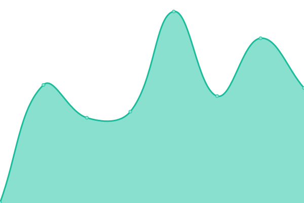

# [📈 Live Status](https://iwyang.github.io/check): <!--live status--> **🟧 Partial outage**

This repository contains the open-source uptime monitor and status page for [iwyang](https://iwyang.github.io), powered by [Upptime](https://github.com/upptime/upptime).

With [Upptime](https://upptime.js.org), you can get your own unlimited and free uptime monitor and status page, powered entirely by a GitHub repository. We use [Issues](https://github.com/iwyang/check/issues) as incident reports, [Actions](https://github.com/iwyang/check/actions) as uptime monitors, and [Pages](https://iwyang.github.io/check) for the status page.

<!--start: status pages-->
<!-- This summary is generated by Upptime (https://github.com/upptime/upptime) -->
<!-- Do not edit this manually, your changes will be overwritten -->
<!-- prettier-ignore -->
| URL | Status | History | Response Time | Uptime |
| --- | ------ | ------- | ------------- | ------ |
|  [01Bore's Notes](https://bore.vip) | 🟩 Up | [01-bore-s-notes.yml](https://github.com/iwyang/check/commits/HEAD/history/01-bore-s-notes.yml) | 

 723ms
     
 | 

<a href="https://iwyang.github.io/check/history/01-bore-s-notes">100.00%</a>
    

|  [05Takagi](https://lixingyong.com) | 🟩 Up | [05-takagi.yml](https://github.com/iwyang/check/commits/HEAD/history/05-takagi.yml) | 

 1886ms
     
 | 

<a href="https://iwyang.github.io/check/history/05-takagi">99.85%</a>
    

|  [10大大的小蜗牛](https://eallion.com) | 🟩 Up | [10.yml](https://github.com/iwyang/check/commits/HEAD/history/10.yml) | 

 1969ms
     
 | 

<a href="https://iwyang.github.io/check/history/10">99.85%</a>
    

|  [11guole's Blog](https://guole.fun) | 🟥 Down | [11guole-s-blog.yml](https://github.com/iwyang/check/commits/HEAD/history/11guole-s-blog.yml) | 

 515ms
     
 | 

<a href="https://iwyang.github.io/check/history/11guole-s-blog">99.99%</a>
    

|  [12cywhat’s blog](https://cywhat.cn) | 🟥 Down | [12cywhat-s-blog.yml](https://github.com/iwyang/check/commits/HEAD/history/12cywhat-s-blog.yml) | 

 337ms
     
 | 

<a href="https://iwyang.github.io/check/history/12cywhat-s-blog">99.99%</a>
    

|  [13Akilarの糖果屋](https://akilar.top) | 🟥 Down | [13-akilar.yml](https://github.com/iwyang/check/commits/HEAD/history/13-akilar.yml) | 

 0ms
     
 | 

<a href="https://iwyang.github.io/check/history/13-akilar">0.00%</a>
    

|  [17张洪Heo](https://blog.zhheo.com/) | 🟩 Up | [17-heo.yml](https://github.com/iwyang/check/commits/HEAD/history/17-heo.yml) | 

 412ms
     
 | 

<a href="https://iwyang.github.io/check/history/17-heo">100.00%</a>
    

|  [19Sianx's Blog](https://siax.cn) | 🟩 Up | [19-sianx-s-blog.yml](https://github.com/iwyang/check/commits/HEAD/history/19-sianx-s-blog.yml) | 

 450ms
     
 | 

<a href="https://iwyang.github.io/check/history/19-sianx-s-blog">100.00%</a>
    

|  [20Leonus](https://blog.leonus.cn/) | 🟩 Up | [20-leonus.yml](https://github.com/iwyang/check/commits/HEAD/history/20-leonus.yml) | 

 1516ms
     
 | 

<a href="https://iwyang.github.io/check/history/20-leonus">100.00%</a>
    

|  [22六月长河](https://kingpo.vercel.app/) | 🟥 Down | [22.yml](https://github.com/iwyang/check/commits/HEAD/history/22.yml) | 

 139ms
     
 | 

<a href="https://iwyang.github.io/check/history/22">99.99%</a>
    

|  [23枫叶](https://blog.aqcoder.cn/) | 🟩 Up | [23.yml](https://github.com/iwyang/check/commits/HEAD/history/23.yml) | 

 427ms
     
 | 

<a href="https://iwyang.github.io/check/history/23">100.00%</a>
    

|  [27lyshark](https://www.lyshark.com/) | 🟩 Up | [27lyshark.yml](https://github.com/iwyang/check/commits/HEAD/history/27lyshark.yml) | 

 1724ms
     
 | 

<a href="https://iwyang.github.io/check/history/27lyshark">100.00%</a>
    

|  [28mao](https://meuicat.com/) | 🟩 Up | [28mao.yml](https://github.com/iwyang/check/commits/HEAD/history/28mao.yml) | 

 538ms
     
 | 

<a href="https://iwyang.github.io/check/history/28mao">100.00%</a>
    

|  [30我不是咕咕鸽](https://blog.laoda.de/) | 🟩 Up | [30.yml](https://github.com/iwyang/check/commits/HEAD/history/30.yml) | 

 589ms
     
 | 

<a href="https://iwyang.github.io/check/history/30">100.00%</a>
    

|  [31CWorld Site](https://cworld.top/) | 🟩 Up | [31-c-world-site.yml](https://github.com/iwyang/check/commits/HEAD/history/31-c-world-site.yml) | 

 410ms
     
 | 

<a href="https://iwyang.github.io/check/history/31-c-world-site">100.00%</a>
    

<!--end: status pages-->

[**Visit our status website →**](https://iwyang.github.io/check)

## 📄 License

- Powered by: [Upptime](https://github.com/upptime/upptime)
- Code: [MIT](./LICENSE) © [iwyang](https://iwyang.github.io)
- Data in the `./history` directory: [Open Database License](https://opendatacommons.org/licenses/odbl/1-0/)
